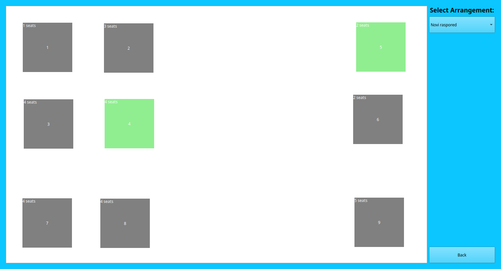

# :coffee: Expresso

Aplikacija namenjena za upotrebu u kaficima.
Korisnik moze da modelira raspored stolova u aplikaciji onako kako izgleda u kafiću, a nakon toga pristupi svakom stolu i tu zapisuje narudžbine i na taj nacin lako prati stanje svakog stola u svom kafiću.

## Okruženje

-  
-   

## :hammer: Pokretanje

Aplikacija se može pokrenuti pomoću QtCreator korisničkog okruženja.
Potrebno je:
- instalirati [QtCreator](https://www.qt.io/product/development-tools)
- klonirati repozitorijum i otvoriti `Expresso.pro` fajl u QtCreator-u
- pokrenuti *Build* klikom na odgovarajuće dugme

## :movie_camera: Demo snimak

[Snimak]() prikaza rada aplikacije.

## Članovi:
 - <a href="https://gitlab.com/Zicko01">Vladan Kozić 024/2020</a>
 - <a href="https://gitlab.com/stemil01">Stefan Milenković 007/2020</a>
 - <a href="https://gitlab.com/ivanadj">~~Ivana Đoković 114/2020~~</a>
 - <a href="https://gitlab.com/jelenab">Jelena Bulajić 061/2019</a>
 - <a href="https://gitlab.com/ivanoviccjelenaa">Jelena Ivanović 365/2019</a>
 - <a href="https://gitlab.com/dragan777">Dragan Mladenović 181/2018</a>
